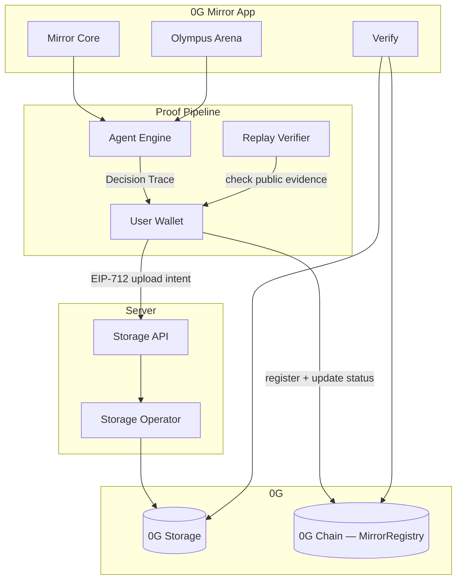
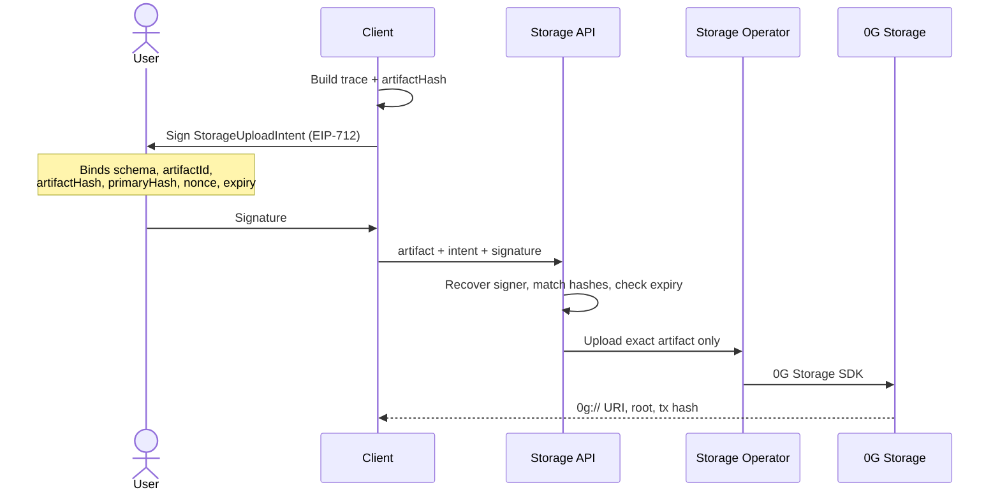
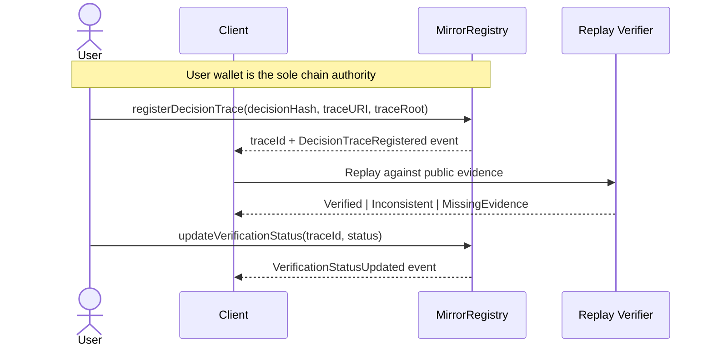
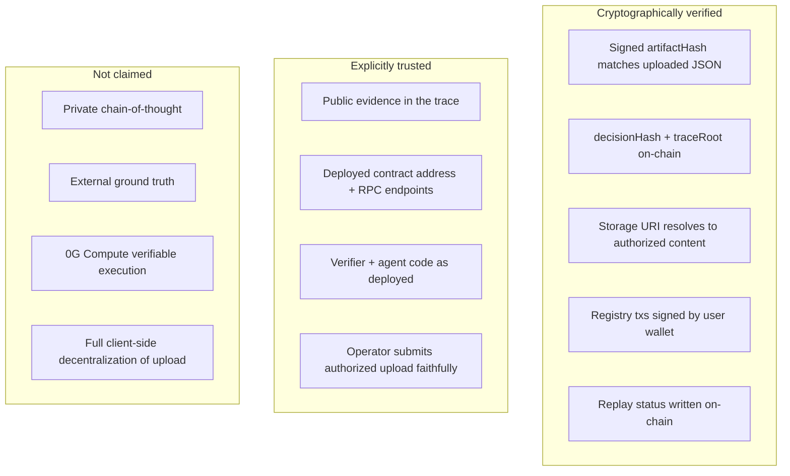

# 0G Mirror — Architecture

Verification infrastructure for AI-agent decisions. Users authorize exact artifacts with wallet signatures; signed artifacts land on **0G Storage**; on-chain attestations are signed by the **user wallet** on **0G Chain** via `MirrorRegistry`.

---

## Judge TL;DR

| Claim | Fact |
| --- | --- |
| What it is | Verification layer — not an agent runtime |
| What is stored | Public rationale, evidence trail, replay result — **not** private chain-of-thought |
| Storage upload | User signs EIP-712 intent → storage operator uploads exact artifact server-side |
| Chain attestation | **User wallet** signs all `MirrorRegistry` writes — no server key on chain |
| 0G role | 0G Storage holds artifacts; 0G Chain holds compact proof — both are load-bearing |
| 0G Compute | **Future work.** MVP uses deterministic replay, not verifiable compute |
| Olympus Arena | Showcase mode demonstrating multi-trace + Court Verdict flow |

---

## 1. System Overview



**Surfaces:** Mirror Core (single trace) · Verify (inspect by ID) · Olympus Arena (two agents + Court Verdict showcase)

**Split:** full JSON on 0G Storage · compact hashes/URIs/status on 0G Chain · wallet signatures at trust boundaries

---

## 2. End-to-End Proof Flow

```mermaid
flowchart LR
    A[Generate Trace] --> B[Compute Hashes]
    B --> C[Sign Upload Intent]
    C --> D[Upload to 0G Storage]
    D --> E[Sign Chain Registration]
    E --> F[Replay Verify]
    F --> G[Sign Status Update]
    G --> H[Auditable Proof]

    style C fill:#1a1a2e,stroke:#4cc9f0
    style E fill:#1a1a2e,stroke:#4cc9f0
    style G fill:#1a1a2e,stroke:#4cc9f0
```



Blue steps = wallet-signed. Everything else is deterministic or operator-executed under user authorization.

### Decision Trace (`0g-mirror/decision-trace/v1`)

| Field | Purpose |
| --- | --- |
| `task` + `evidence` | Input and public facts for replay |
| `decision.publicRationale` | Auditable reasoning — not private CoT |
| `hashes.decisionHash` | Stable commitment to the decision |
| `storage` | `0g://` URI, root, storage tx |
| `attestation` | Registry trace ID, chain tx |
| `verification` | `Verified` / `Inconsistent` / `MissingEvidence` |

Schema: `apps/web/lib/schemas/decision-trace.ts`

---

## 3. Wallet-Authorized Storage Upload



### Storage operator — honest role

The operator is **not a relayer**. It is a server-side executor that submits uploads the user has already authorized.

| Operator can | Operator cannot (undetectably) |
| --- | --- |
| Pay for and submit the upload | Change artifact after user signature |
| Upload the exact authorized JSON | Swap evidence, output, or public rationale |
| Return URI, root, storage tx | Sign on-chain attestations |

Tampering breaks the signed `artifactHash` → on-chain `traceRoot` / `decisionHash` mismatch.

**Why server-side?** Browser 0G SDK calls fail on deployed origins (CORS/runtime). Upload without user authorization would be weaker. This model keeps reliability **and** user provenance.

Implementation: `storage-intent.ts` · `client-storage.ts` · `api/storage/upload/route.ts`

Env: `OG_STORAGE_RPC`, `OG_STORAGE_INDEXER`, `OG_STORAGE_PRIVATE_KEY` — **storage only, never chain writes**

---

## 4. Wallet-Signed Chain Attestation



### MirrorRegistry

Compact on-chain record. Full JSON stays on 0G Storage.

```solidity
struct DecisionTrace {
    address creator;           // msg.sender — the user wallet
    bytes32 decisionHash;
    string  traceURI;
    bytes32 traceRoot;
    uint256 createdAt;
    VerificationStatus status;
}
```

| Function | Signer |
| --- | --- |
| `registerDecisionTrace` | User wallet |
| `updateVerificationStatus` | User wallet |
| `registerCourtVerdict` | User wallet |

Contract: `contracts/contracts/MirrorRegistry.sol`  
Galileo: `0x8c5C403994CC7a5A469bBF82904e504060109858`

No server private key touches 0G Chain. Period.

---

## 5. Trust Boundaries



### Threat responses

- **Artifact swap** → hash/root mismatch exposes it
- **Unauthorized upload** → rejected without valid EIP-712 signature
- **Forged attestation** → requires user's wallet key
- **Fabricated evidence** → not detected; evidence is a trusted input

---

## Replay Verification

Deterministic re-execution against **submitted public evidence**. Checks whether the recorded decision label matches replay output.

| Status | Meaning |
| --- | --- |
| `Verified` | Replay matches recorded label |
| `Inconsistent` | Replay conflicts with recorded label |
| `MissingEvidence` | Required public evidence absent |

Implementation: `apps/web/lib/ai/verifier.ts`

**MVP:** deterministic local agents for stable demos.  
**Future:** 0G Compute-backed verifiable execution — not implemented, not claimed.

---

## Olympus Arena (Showcase)

Two agents → two Decision Traces → replay both → Olympus Judge emits Court Verdict → same wallet-authorized storage + wallet-signed attestation flow.

Not a separate product. Demonstrates multi-trace disputes on the same infrastructure.

Schema: `0g-mirror/court-verdict/v1` · Implementation: `judge.ts`, `arena-pipeline.ts`

---

## MVP vs Future

| | Now (MVP) | Future |
| --- | --- | --- |
| Agents | Deterministic local | External model adapters |
| Verification | Deterministic replay | **0G Compute** execution |
| Storage upload | Wallet-authorized, server-side | Optional client-side path |
| Discovery | In-app + proof files | Public Trace Explorer |

---

## Live Proof

| Item | Value |
| --- | --- |
| Chain ID | `16602` |
| MirrorRegistry | [`0x8c5C…09858`](https://chainscan-galileo.0g.ai/address/0x8c5C403994CC7a5A469bBF82904e504060109858) |
| Trace ID | `1` · `Verified` |
| Decision Hash | `0x7f1775e02212e8764cefc347a09df82aa33ebe05d377e2bb496fb9c2fe1da884` |
| Storage URI | [`0g://0xe58925c6…ef4aee`](https://storagescan-galileo.0g.ai/search?q=0xe58925c613298780175066ae3e2762e6154b152329a3b3c8b532716196ef4aee) |
| Txs | [Storage](https://chainscan-galileo.0g.ai/tx/0x109b3457bc7a0b0032b1d81bc773f8664c5dbaaa310adb46d73bdb7360757a03) · [Register](https://chainscan-galileo.0g.ai/tx/0x439d5a8bca2bd17b051738d12124b90a0c5cb3ab5c1cc996a76e45137f3b23de) · [Verify](https://chainscan-galileo.0g.ai/tx/0x7061af685a1c61e3db2ee976034baad35da506b73464a737dace23027eae2515) |

Files: `proofs/real-0g-proof.json` · `proofs/downloaded-real-trace.json`
